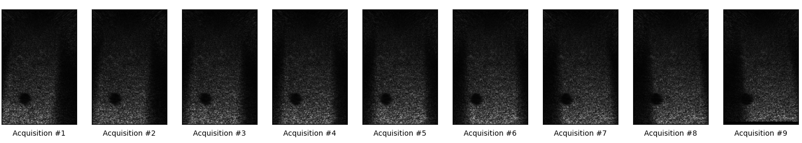

# fast-DAS
Parallel delay-and-sum implementation wrapping native CUDA from python  

<p align="center" width="100%">
     
</p>

## About
- Supports windows and unix
- Uses CPU-multithreading when ```use_gpu``` is ```False```
- Uses NVIDIA CUDA library when ```use_gpu``` is ```True```
- Cross-compiled on windows using WSL and CMake

## Usage
fast-DAS is a python wrapper and native code implementation for the delay-and-sum algorithm pre-compiled in C++ (CPU version) and CUDA (GPU version).  
The goal is to boost the digital beamforming process for ultrasound acquisitions.

### Installation

```console
pip install fast-das
```

### Note on Windows/CPU usage
In Windows, you may encounter the following error when setting the use_gpu flag to False:

```console
FileNotFoundError: Could not find module '..\lib\site-packages\fastDAS\bin\libdas.dll' (or one of its dependencies). Try using the full path with constructor syntax.
```

This is because multi-threading is performed with the pthreads library, which is not natively included in Windows.
pthreads is included in MinGW, so adding gcc to your conda environment will resolve this issue (for example from [here](https://anaconda.org/conda-forge/m2w64-toolchain)).
### Input format
To beamform with fast-DAS, initialize a DAS object based on your compute preference (CPU/GPU):

```python
    from fastDAS import delay_and_sum as fd
    das = fd.DAS(use_gpu=True)
```

For <i>out-of-the-box</i> usage with Verasonics Vantage systems, save the MATLAB workspace after collecting an RF acquisition.  
The workspace file should contain at least the following variables as a .mat file:

```
    {
        'NA': {'NA_tot':_, 'NA':_},
        'PData': {
            'Size': _,
            'PDelta': _,
            'Origin': _,
        },
        'Trans': {
            'lensCorrection': _,
            'ElementPos': _,
            'WavelenToMm': _,
        },
        'TX': {
            'Steer': _,
            'Delay': _,
        },
        'TW': {
            'Peak': _
        },
        'Receive': {
            'SamplesPerWave': _,
            'StartDepth': _,
            'StartSample': _,
            'EndSample': _
        }
    }
```

In a plane wave compounding acqusition, the ```init_delays()``` function can be used to calculate the Tx and Rx delay map based on a workspace like the one above.  
Otherwise, you can implement the ```del_Tx``` and ```del_Rx``` variables yourself.  
Note that the units of these delay maps are not ```[usec]``` but rather ```[samples]```.

### Customized Usage
If you want to use the native code wrapper in an acquisition other than plane wave steering, calculate your own del_Tx and del_Rx delays.  
You'll need to provide the DAS class with some basic information on the acquisition protocol (see DAS.beamform() docstring for specific details)
```python

    das = fd.DAS(use_gpu=True)

    del_Tx = np.zeros((NA, FOVz, FOVx), dtype=np.float32)
    del_Rx = np.zeros((n_el, FOVz, FOVx), dtype=np.float32)

    # Calc the delays
    # ...
    
    das.del_Tx = del_Tx
    das.del_Rx = del_Rx

    RF = get_your_RF_data()
    das.beamform(RF, N, start_sample, end_sample)
```
